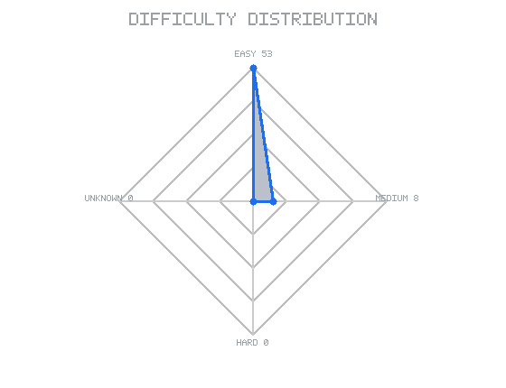
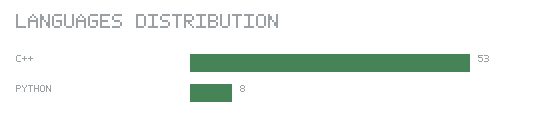
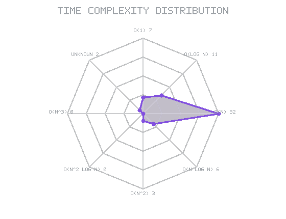
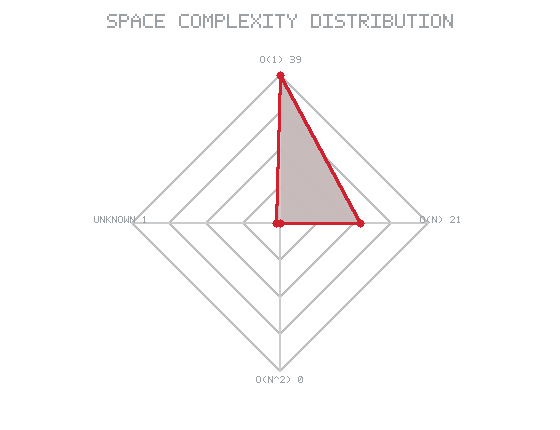

# DSA
there is all leetcode DSA question in this repp

<!-- AUTO_STATS_START -->

## LeetCode Journey

**61 problems solved** — difficulty, languages and complexity, tracked automatically.

<table>
<tr>
<td align="center">🧠 <b>61</b> Solved</td>
<td align="center">🟢 <b>53</b> Easy</td>
<td align="center">🟠 <b>8</b> Medium</td>
<td align="center">🔴 <b>0</b> Hard</td>
</tr>
<tr>
<td align="center">💻 <b>2</b> Languages</td>
<td align="center">⭐ <b>C++</b> Most used</td>
<td align="center">⚡ <b>97%</b> Time analyzed</td>
<td align="center">💾 <b>98%</b> Space analyzed</td>
</tr>
</table>

---

## 🎯 Progress

**61** problems solved

🟢 Easy — **53** 
🟠 Medium — **8** 
🔴 Hard — **0**

<picture>
  <source srcset="assets/stats/difficulty-radar.svg" type="image/svg+xml">
  
</picture>

---

## 📊 Performance

Difficulty mix at a glance — the radar scales with the numbers above, so it stays truthful as new problems land.

---

## 💻 Language Profile

C++ — **53** 
Python — **8** 

<picture>
  <source srcset="assets/stats/language-radar.svg" type="image/svg+xml">
  
</picture>

_Fewer than three languages today renders as compact bars; the radar takes over automatically once more languages appear._

---

## ⚡ Complexity Profile

<table>
<tr>
<td align="center"><b>Time</b> <picture>
  <source srcset="assets/stats/time-complexity-radar.svg" type="image/svg+xml">
  
</picture></td>
<td align="center"><b>Space</b> <picture>
  <source srcset="assets/stats/space-complexity-radar.svg" type="image/svg+xml">
  
</picture></td>
</tr>
</table>

Most common time: **O(1)** · Most common space: **O(1)**

Time analyzed: **59/61** · Space analyzed: **60/61**

_Unknown means the analyzer was not confident enough — intentional, and preferred over a wrong guess._

---

## 🧩 All Problems

| # | Problem | Difficulty | Language | Time | Space |
|---:|---|:---:|:---:|:---:|:---:|
| 7 | [Reverse Integer](https://leetcode.com/problems/reverse-integer/) | 🟠 Medium | C++ | O(log n) | O(1) |
| 14 | [Longest Common Prefix](https://leetcode.com/problems/longest-common-prefix/) | 🟢 Easy | C++ | O(n log n) | O(n) |
| 20 | [Valid Parentheses](https://leetcode.com/problems/valid-parentheses/) | 🟢 Easy | C++ | O(n) | O(n) |
| 26 | [Remove Duplicates From Sorted Array](https://leetcode.com/problems/remove-duplicates-from-sorted-array/) | 🟢 Easy | Python | O(n log n) | Unknown |
| 35 | [Search Insert Position](https://leetcode.com/problems/search-insert-position/) | 🟢 Easy | C++ | O(log n) | O(1) |
| 48 | [Rotate Image](https://leetcode.com/problems/rotate-image/) | 🟠 Medium | C++ | O(n^2) | O(1) |
| 69 | [Sqrtx](https://leetcode.com/problems/sqrtx/) | 🟢 Easy | C++ | O(log n) | O(1) |
| 70 | [Climbing Stairs](https://leetcode.com/problems/climbing-stairs/) | 🟢 Easy | C++ | O(n) | O(n) |
| 73 | [Set Matrix Zeroes](https://leetcode.com/problems/set-matrix-zeroes/) | 🟠 Medium | C++ | O(n^2) | O(n) |
| 125 | [Valid Palindrome](https://leetcode.com/problems/valid-palindrome/) | 🟢 Easy | Python | O(n) | O(n) |
| 136 | [Single Number](https://leetcode.com/problems/single-number/) | 🟢 Easy | C++ | O(n) | O(n) |
| 217 | [Contains Duplicate](https://leetcode.com/problems/contains-duplicate/) | 🟢 Easy | C++ | O(n) | O(n) |
| 242 | [Valid Anagram](https://leetcode.com/problems/valid-anagram/) | 🟢 Easy | Python | O(n log n) | O(1) |
| 258 | [Add Digits](https://leetcode.com/problems/add-digits/) | 🟢 Easy | C++ | Unknown | O(1) |
| 268 | [Missing Number](https://leetcode.com/problems/missing-number/) | 🟢 Easy | C++ | O(n) | O(1) |
| 278 | [First Bad Version](https://leetcode.com/problems/first-bad-version/) | 🟢 Easy | C++ | O(log n) | O(1) |
| 287 | [Find The Duplicate Number](https://leetcode.com/problems/find-the-duplicate-number/) | 🟠 Medium | C++ | O(n) | O(1) |
| 326 | [Power Of Three](https://leetcode.com/problems/power-of-three/) | 🟢 Easy | C++ | O(1) | O(1) |
| 349 | [Intersection Of Two Arrays](https://leetcode.com/problems/intersection-of-two-arrays/) | 🟢 Easy | C++ | O(n) | O(n) |
| 367 | [Valid Perfect Square](https://leetcode.com/problems/valid-perfect-square/) | 🟢 Easy | C++ | O(log n) | O(1) |
| 374 | [Guess Number Higher Or Lower](https://leetcode.com/problems/guess-number-higher-or-lower/) | 🟢 Easy | C++ | O(log n) | O(1) |
| 383 | [Ransom Note](https://leetcode.com/problems/ransom-note/) | 🟢 Easy | Python | O(n) | O(1) |
| 389 | [Find The Difference](https://leetcode.com/problems/find-the-difference/) | 🟢 Easy | C++ | O(n log n) | O(1) |
| 412 | [Fizz Buzz](https://leetcode.com/problems/fizz-buzz/) | 🟢 Easy | C++ | O(n) | O(n) |
| 442 | [Find All Duplicates In An Array](https://leetcode.com/problems/find-all-duplicates-in-an-array/) | 🟠 Medium | C++ | O(n) | O(n) |
| 507 | [Perfect Number](https://leetcode.com/problems/perfect-number/) | 🟢 Easy | C++ | O(n) | O(1) |
| 520 | [Detect Capital](https://leetcode.com/problems/detect-capital/) | 🟢 Easy | Python | O(1) | O(1) |
| 557 | [Reverse Words In A String Iii](https://leetcode.com/problems/reverse-words-in-a-string-iii/) | 🟢 Easy | C++ | O(n) | O(n) |
| 742 | [To Lower Case](https://leetcode.com/problems/to-lower-case/) | 🟢 Easy | Python | O(1) | O(1) |
| 782 | [Jewels And Stones](https://leetcode.com/problems/jewels-and-stones/) | 🟢 Easy | C++ | O(n) | O(1) |
| 792 | [Binary Search](https://leetcode.com/problems/binary-search/) | 🟢 Easy | C++ | O(log n) | O(1) |
| 1406 | [Subtract The Product And Sum Of Digits Of An Integer](https://leetcode.com/problems/subtract-the-product-and-sum-of-digits-of-an-integer/) | 🟢 Easy | C++ | O(log n) | O(1) |
| 1585 | [The Kth Factor Of N](https://leetcode.com/problems/the-kth-factor-of-n/) | 🟠 Medium | C++ | O(n) | O(n) |
| 1894 | [Merge Strings Alternately](https://leetcode.com/problems/merge-strings-alternately/) | 🟢 Easy | Python | O(n) | O(n) |
| 1944 | [Truncate Sentence](https://leetcode.com/problems/truncate-sentence/) | 🟢 Easy | C++ | O(n) | O(n) |
| 1950 | [Sign Of The Product Of An Array](https://leetcode.com/problems/sign-of-the-product-of-an-array/) | 🟢 Easy | Python | O(n) | O(1) |
| 1960 | [Check If The Sentence Is Pangram](https://leetcode.com/problems/check-if-the-sentence-is-pangram/) | 🟢 Easy | C++ | O(n) | O(1) |
| 2015 | [Determine Whether Matrix Can Be Obtained By Rotation](https://leetcode.com/problems/determine-whether-matrix-can-be-obtained-by-rotation/) | 🟢 Easy | C++ | O(n^2) | O(1) |
| 2048 | [Build Array From Permutation](https://leetcode.com/problems/build-array-from-permutation/) | 🟢 Easy | C++ | O(n) | O(n) |
| 2083 | [Three Divisors](https://leetcode.com/problems/three-divisors/) | 🟢 Easy | C++ | O(n) | O(1) |
| 2265 | [Partition Array According To Given Pivot](https://leetcode.com/problems/partition-array-according-to-given-pivot/) | 🟠 Medium | C++ | O(n) | O(n) |
| 2383 | [Add Two Integers](https://leetcode.com/problems/add-two-integers/) | 🟢 Easy | C++ | O(1) | O(1) |
| 2486 | [Most Frequent Even Element](https://leetcode.com/problems/most-frequent-even-element/) | 🟢 Easy | C++ | O(n log n) | O(n) |
| 2491 | [Smallest Even Multiple](https://leetcode.com/problems/smallest-even-multiple/) | 🟢 Easy | C++ | O(1) | O(1) |
| 2502 | [Sort The People](https://leetcode.com/problems/sort-the-people/) | 🟢 Easy | C++ | O(n log n) | O(n) |
| 2608 | [Count The Digits That Divide A Number](https://leetcode.com/problems/count-the-digits-that-divide-a-number/) | 🟢 Easy | C++ | O(log n) | O(1) |
| 2614 | [Maximum Count Of Positive Integer And Negative Integer](https://leetcode.com/problems/maximum-count-of-positive-integer-and-negative-integer/) | 🟢 Easy | C++ | O(n) | O(1) |
| 2634 | [Minimum Common Value](https://leetcode.com/problems/minimum-common-value/) | 🟢 Easy | C++ | O(n) | O(1) |
| 2752 | [Sum Multiples](https://leetcode.com/problems/sum-multiples/) | 🟢 Easy | C++ | O(n) | O(1) |
| 3172 | [Divisible And Non Divisible Sums Difference](https://leetcode.com/problems/divisible-and-non-divisible-sums-difference/) | 🟢 Easy | C++ | O(1) | O(1) |
| 3371 | [Harshad Number](https://leetcode.com/problems/harshad-number/) | 🟢 Easy | C++ | O(log n) | O(1) |
| 3379 | [Score Of A String](https://leetcode.com/problems/score-of-a-string/) | 🟢 Easy | C++ | O(n) | O(1) |
| 3476 | [Find Minimum Operations To Make All Elements Divisible By Three](https://leetcode.com/problems/find-minimum-operations-to-make-all-elements-divisible-by-three/) | 🟢 Easy | C++ | O(n) | O(1) |
| 3581 | [The Two Sneaky Numbers Of Digitville](https://leetcode.com/problems/the-two-sneaky-numbers-of-digitville/) | 🟢 Easy | C++ | O(n) | O(n) |
| 3830 | [Find Closest Person](https://leetcode.com/problems/find-closest-person/) | 🟢 Easy | C++ | O(1) | O(1) |
| 3846 | [Minimum Operations To Make Array Sum Divisible By K](https://leetcode.com/problems/minimum-operations-to-make-array-sum-divisible-by-k/) | 🟢 Easy | C++ | O(n) | O(1) |
| 3869 | [Smallest Index With Digit Sum Equal To Index](https://leetcode.com/problems/smallest-index-with-digit-sum-equal-to-index/) | 🟢 Easy | C++ | Unknown | O(1) |
| 4008 | [Restore Finishing Order](https://leetcode.com/problems/restore-finishing-order/) | 🟢 Easy | C++ | O(n) | O(n) |
| 4058 | [Compute Alternating Sum](https://leetcode.com/problems/compute-alternating-sum/) | 🟢 Easy | C++ | O(n) | O(1) |
| 4087 | [Maximum Substrings With Distinct Start](https://leetcode.com/problems/maximum-substrings-with-distinct-start/) | 🟠 Medium | C++ | O(n) | O(n) |
| 4168 | [Mirror Distance Of An Integer](https://leetcode.com/problems/mirror-distance-of-an-integer/) | 🟢 Easy | C++ | O(log n) | O(1) |

---

## 💓 Repository Pulse

Problems solved: **61** · Languages: **2** · Complexity analyzed: **95%** · Last updated: **2026-10-02**

---

_Generated automatically from this repository._

<!-- AUTO_STATS_END -->
